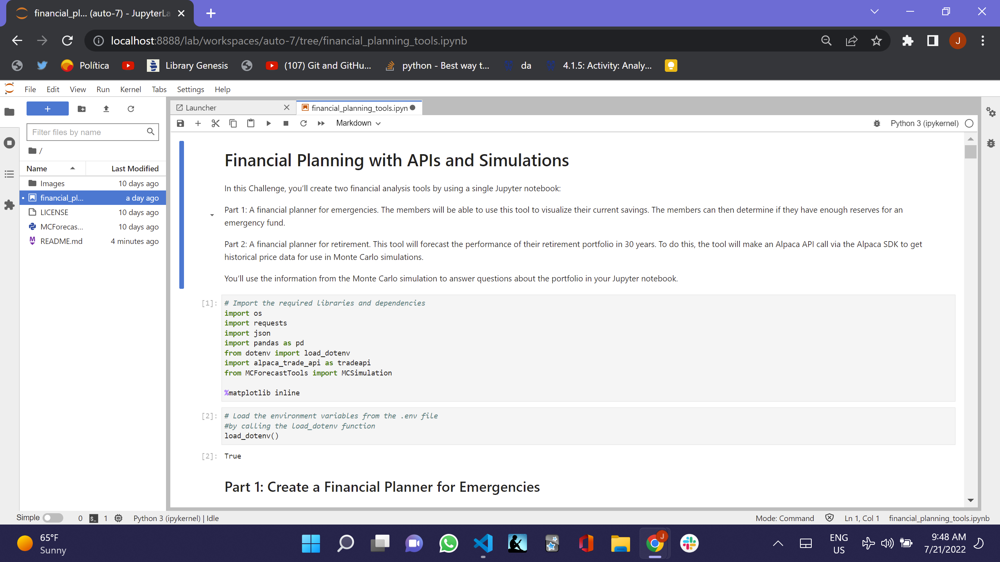
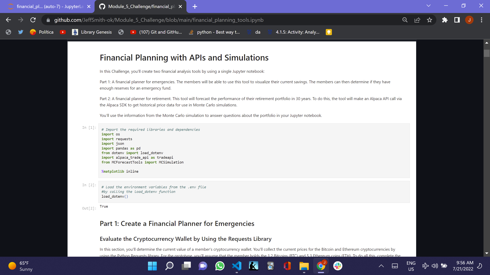

# Retirement and Emergency Financial Planning with APIs and Monte Carlo Simulations

In this Challenge, I’ll create two financial analysis tools by using a single Jupyter notebook:

Part 1: A financial planner for emergencies. The members will be able to use this tool to visualize their current savings. The members can then determine if they have enough reserves for an emergency fund.

Part 2: A financial planner for retirement. This tool will forecast the performance of their retirement portfolio in 30 years. To do this, the tool will make an Alpaca API call via the Alpaca SDK to get historical price data for use in Monte Carlo simulations.

I’ll use the information from the Monte Carlo simulation to answer questions about the portfolio in my Jupyter notebook.

## Technologies

This was developed with Anaconda, which includes Pandas, Matplotlib and Jupyter_Lab and I created it in a development environment running Python 3.7.13.

---

## Installation Guide

To install the programs to run the program, you have to do the following or you can open 'financial_planning_tools.ipynb' in github and read the file there.

Install Anaconda and Python. </br>

Git clone the repo and run it, pursuant to the following clone address

git clone https://github.com/JeffSmith-ok/Module_5_Challenge

cd Module_5_challenge

In the terminal type 'Jupyter Lab'

---

## Usage

The following images show the notebook read in Juypter Lab and in Github under financial_planning_tools.ipynb.

##  </br>

## 

---

## Contributors

This is the fifth of the individual learning challenges.

My contact information is:

Name: Jeffrey M. Smith </br>
Linkedin: https://www.linkedin.com/in/jeffsmith77/ </br>
Personal email: jmstranslate@gmail.com </br>
Phone: 332 238 5209

---

## License

MIT License

Copyright (c) 2022 Jeffrey M. Smith

Permission is hereby granted, free of charge, to any person obtaining a copy of this software and associated documentation files (the "Software"), to deal in the Software without restriction, including without limitation the rights to use, copy, modify, merge, publish, distribute, sublicense, and/or sell
copies of the Software, and to permit persons to whom the Software is furnished to do so, subject to the following conditions:

The above copyright notice and this permission notice shall be included in all copies or substantial portions of the Software.

THE SOFTWARE IS PROVIDED "AS IS", WITHOUT WARRANTY OF ANY KIND, EXPRESS OR IMPLIED, INCLUDING BUT NOT LIMITED TO THE WARRANTIES OF MERCHANTABILITY, FITNESS FOR A PARTICULAR PURPOSE AND NONINFRINGEMENT. IN NO EVENT SHALL THE AUTHORS OR COPYRIGHT HOLDERS BE LIABLE FOR ANY CLAIM, DAMAGES OR OTHER LIABILITY, WHETHER IN AN ACTION OF CONTRACT, TORT OR OTHERWISE, ARISING FROM, OUT OF OR IN CONNECTION WITH THE SOFTWARE OR THE USE OR OTHER DEALINGS IN THE
SOFTWARE.

```

```
